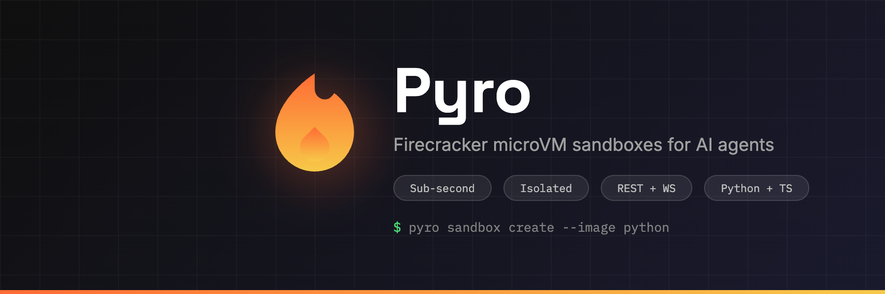

<p align="center">
  
</p>

<p align="center">
  <a href="https://github.com/danievanzyl/pyro/actions"></a>
  <a href="https://goreportcard.com/report/github.com/danievanzyl/pyro"></a>
  <a href="LICENSE"></a>
  <a href="https://pypi.org/project/pyro-sdk/"></a>
  <a href="https://www.npmjs.com/package/@pyrovm/sdk"></a>
</p>

## Features

- **Fast** — sub-second sandbox creation with snapshot pools
- **Isolated** — each sandbox is a Firecracker microVM with its own kernel
- **Simple API** — REST + WebSocket + SSE for sandbox lifecycle
- **Multi-image** — default, minimal, ubuntu, python, node base images
- **SDKs** — Python and TypeScript clients
- **Dashboard** — built-in SvelteKit UI for fleet management
- **Observability** — OpenTelemetry metrics, Prometheus endpoint, audit log

## Quickstart

### Python

```bash
pip install pyro-sdk
```

```python
import asyncio
from pyro_sdk import Pyro

async def main():
    pyro = Pyro(api_key="pk_...", base_url="http://localhost:8080")

    async with await pyro.sandbox.create(image="python") as sb:
        result = await sb.run("print('Hello from Pyro!')")
        print(result.stdout)

asyncio.run(main())
```

### TypeScript

```bash
npm install @pyrovm/sdk
```

```typescript
import { Pyro } from '@pyrovm/sdk'

const pyro = new Pyro({ apiKey: 'pk_...', baseUrl: 'http://localhost:8080' })
const sandbox = await pyro.sandbox.create({ image: 'python', timeout: 300 })
const result = await sandbox.run('print("Hello from Pyro!")')
console.log(result.stdout)
await sandbox.stop()
```

### CLI

```bash
export PYRO_API_KEY=pk_...
pyro sandbox create --image python --ttl 300
pyro sandbox exec <id> python3 -c "print('hello')"
pyro sandbox kill <id>
```

## Architecture

```
┌─────────────┐     ┌──────────────┐     ┌─────────────────┐
│  SDK / CLI  │────▶│  pyro-server │────▶│  Firecracker VM │
│             │ HTTP│  (REST API)  │vsock│  (pyro-agent)   │
└─────────────┘     └──────────────┘     └─────────────────┘
                           │
                    ┌──────┴──────┐
                    │   SQLite    │
                    │  (state DB) │
                    └─────────────┘
```

- **pyro-server** — HTTP API server managing VM lifecycle, auth, quotas, and file operations
- **pyro-agent** — runs as PID 1 inside each VM, handles exec/file commands over vsock
- **pyro** — CLI for host setup, image building, and sandbox operations

## API Endpoints

| Method | Path | Description |
|--------|------|-------------|
| `POST` | `/api/sandboxes` | Create sandbox |
| `GET` | `/api/sandboxes` | List sandboxes |
| `GET` | `/api/sandboxes/{id}` | Get sandbox |
| `DELETE` | `/api/sandboxes/{id}` | Destroy sandbox |
| `POST` | `/api/sandboxes/{id}/exec` | Execute command |
| `PUT` | `/api/sandboxes/{id}/files/*` | Write file |
| `GET` | `/api/sandboxes/{id}/files/*` | Read file |
| `GET` | `/api/sandboxes/{id}/ws` | WebSocket streaming exec |
| `GET` | `/api/images` | List images |
| `POST` | `/api/images` | Create image from Dockerfile |
| `GET` | `/api/events` | SSE event stream |
| `GET` | `/api/health` | Health check |

## Self-hosting

Requires a Linux host with KVM support.

```bash
# One-command setup (kernel, images, bridge, systemd)
sudo pyro setup

# Create an API key
pyro create-key my-key

# Start the server
systemctl start pyro
```

### Build from source

```bash
make build          # build all binaries
make build-linux    # cross-compile for Linux
make deploy         # build + SCP to remote host
```

## Images

| Image | Size | Includes |
|-------|------|----------|
| `minimal` | 50 MB | Alpine base, busybox |
| `default` | 50 MB | Alpine + common tools |
| `ubuntu` | 1 GB | Ubuntu 22.04 |
| `python` | 1 GB | Ubuntu + Python 3.12 + pip |
| `node` | 1 GB | Ubuntu + Node.js 22 + npm |

Build custom images from Dockerfiles:

```bash
pyro build-image <name>
# or via API:
curl -X POST /api/images -d '{"name":"custom","dockerfile":"..."}'
```

## Configuration

### Environment variables

| Variable | Description | Default |
|----------|-------------|---------|
| `PYRO_API_KEY` | API key for SDK/CLI | — |
| `PYRO_BASE_URL` | Server URL | `http://localhost:8080` |
| `PYRO_DB` | SQLite database path | `/opt/pyro/db/pyro.db` |
| `PYRO_IMAGES` | Images directory | `/opt/pyro/images` |

### Server flags

```
--listen          API listen address (default :8080)
--db              SQLite path
--images-dir      Base images directory
--max-sandboxes   Max concurrent VMs (default 100)
--max-per-key     Max VMs per API key (default 10)
--rate-limit      Creates per minute per key (default 30)
--pool-size       Warm snapshot pool per image (default 0)
--prometheus      Enable /metrics endpoint
```

## SDKs

| SDK | Package | Docs |
|-----|---------|------|
| Python | [`pyro-sdk`](sdk/python/) | [README](sdk/python/README.md) |
| TypeScript | [`@pyrovm/sdk`](sdk/typescript/) | [README](sdk/typescript/README.md) |

## Examples

- [Code Runner](examples/code-runner/) — run user-provided Python code in isolated sandboxes
- [LangChain Agent](examples/langchain-agent/) — give an LLM agent a sandboxed code execution tool

## License

MIT
